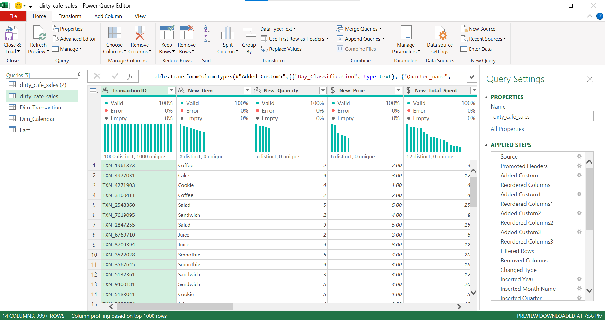
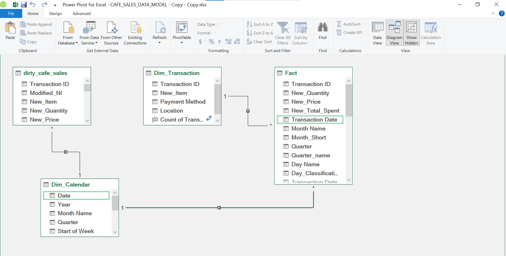

# Payment Optimization and Customer Behavior Analysis of Justus Café Customers

### Table of Contents
- [Introduction](#introduction)
- [Data Sources](#data-sources)
- [Business Questions](#business-questions)
- [Tools Used](#tools-used)
- [Data Cleaning and Transformation](#data-cleaning-and-transformation)
- [Data Modeling](#data-modeling)
- [Dashboard](#dashboard)
- [Key Insights](#key-insights)
- [Recommendations](#recommendations)
- [Stakeholders](#stakeholders)
- [Limitations](#limitations)
  
### Introduction
Justus Café is experiencing mixed payment adoption across different transaction values, with heavy cash usage leading to long queues during peak hours. By analyzing customer payment behaviors, item preferences, and sales trends, this project provides actionable insights to:
- Improve transaction efficiency
- Enhance customer experience
- Identify upselling and revenue optimization opportunities
  
### Data Sources
Café Sales Data: The primary dataset used for this is analysis is the "dirty_cafe_sales.csv" dataset obtained from [Kaggle](https://www.kaggle.com/datasets/ahmedmohamed2003/cafe-sales-dirty-data-for-cleaning-training?resource=download), containing information about the sales made by Justus Café. The dataset consist of 10000 rows and 12 columns.

### Business Questions
- What is the highest selling product by transaction count?
- What day of the week records the highest sales?
- How do payment methods (cash, credit card, digital wallet) vary across low-value (<= $4) and high-value (>= $20) transactions?
- What incentives could shift payment preferences toward faster methods?
- What upselling opportunities exist to improve customer spend?
- Which months and quarters generate the most revenue?
- What payment methods are preferred across different customer categories?
- What is the highest revenue-generating product, and what is the location preference?
- Which channel (in-store vs. takeaway) produces the most sales?
- Do sales peak during weekdays or weekends?
### Tools Used
- MS Excel
- Power Query – data cleaning & transformation
- Power Pivot (Star Schema) – fact & dimension modeling
- DAX – revenue, transaction count, averages
- Pivot Tables & Dashboards – interactive visuals
### Data Cleaning and Transformation
The raw dataset contained missing, inconsistent, and incorrect values. The data cleaning was done using the power query editor. First the rows with no transaction date, no location and no payment methods were removed. The sales data in some instances had price without quantity, quantity without price, sales amount with price but no quantity. Since sales amount equals price times quantity. I created the following If condition logic: 
// This formula calculates the unit price when missing, using total spent divided by quantity
**Price Column Calculation**
```
m
= if [Price Per Unit] = null or [Price Per Unit] = "" or [Price Per Unit] = "UNKNOWN" or [Price Per Unit] = "ERROR" then 
   (if [Quantity] <> null and [Total Spent] <> null 
   then Number.From([Total Spent]) / Number.From([Quantity]) 
   else "Unknown") 
else try Number.From([Price Per Unit]) otherwise "Unknown"
```
\\ This formula calculates the total amount spent when missing, using price multiplied by quantity
**Sales Amount Column Calculation**
```
m
= if [Total Spent] = null or [Total Spent] = "" or [Total Spent] = "UNKNOWN" or [Total Spent] = "ERROR" then 
   (if [New_Price] <> "Unknown" and [New_Quantity] <> "Unknown" 
   then Number.From([New_Quantity]) * Number.From([New_Price]) 
   else "Unknown") 
else try Number.From([Total Spent]) otherwise "Unknown"
```
The applied steps can be found in . 

\\ This formula classifies day into weekday or weekend
Day Classification
```
m
= if Date.DayOfWeek([Transaction Date]) = 0 or Date.DayOfWeek([Transaction Date]) = 6 
   then "Weekend" 
   else "Weekday"
```
** Dataset After Cleaning**
The following dataset was obtained after cleaning [Cleaned_Dataset](https://github.com/timothyakintayo/Cafe-Sales-Analysis/blob/main/Cleaned_Cafe_Sales_Data.xlsx)
### Data Modeling
In Power Query, the data was splitted into fact and dimension tables and modelled using the diagram view in Power Pivot.
- Fact and dimension tables created in Power Query.
- Modeled into a star schema in Power Pivot.
**A snapshot of the data model** 
- **Key DAX measures:**
\\ These measures were created in Power Pivot to calculate revenue trends and transaction metrics for the dashboard.
```
DAX
Quarterly Revenue = TOTALQTD([Revenue], Dim_Calendar[Date])
Total Transactions = COUNT(Dim_Transaction[Transaction ID])
Average Transaction Value = AVERAGE(Fact[New_Total_Spent])
```
## 🔢 Dynamic Excel Formulas for Automated Insights

To make the dashboard interactive and ensure insights update automatically when new data is refreshed, I used **dynamic Excel formulas** (INDEX, MATCH, MAX, TEXT).  
These generate text-based insights directly on the dashboard without manual editing.

### Example Formulas with Explanations

```excel
="Highest Performing Month: "&INDEX(J19:J30,MATCH(MAX(K19:K30),K19:K30,0))&" with "&TEXT(MAX(K19:K30),"$#,##0")&" in sales"
```
### Dashboard
The interactive dashboard contains two pages


Screenshots:


### Key Insights
- Top Product: Salad – highest transactions and revenue.
- Peak Day (Transactions): Friday.
- Peak Day (Revenue): Thursday.
- Payment Split (High-Value Transactions ≥ $20): 37% digital wallet, 33% cash, 30% credit card.
- Channel Preference: High-spending customers prefer in-store.
- Revenue Peaks: January (monthly), Q1 (quarterly).
- Customer Spend: 50% spend $4–12, 25% above $12, and 5% spend above $20

### Recommendations
- Shift from Cash to Digital: Offer digital wallet/card discounts, loyalty points, and speed-focused campaigns (“Skip the wait: Pay digitally”). Train staff to promote cashless options during peak hours.
- Upselling & Combos: Introduce combo deals (e.g., Salad + Juice, Sandwich + Coffee) and train staff to suggest add-ons during busy periods.
- In-Store Experience: Customers spend more in-store; enhance dine-in experience and menu variety (e.g., more salad options).
- Revenue Optimization: Leverage Fridays (highest traffic) for upselling campaigns.

### Stakeholders
- Cafe Operations Manager: Reduce queues, optimize staff workflows.
- Finance/Revenue Manager: Drive revenue growth.
- Marketing Manager: Segment customers, design promotions.

### Limitations
A significant part of the data was dropped while trying to match the price, quantity and amount spent column especially the price column. This is because, it was impossible to perfectly match the items based on the price because items such as "Smoothie and Sandwich", "Juice and Cake" had the same prices. To avoid data bias, these rows were dropped. 
### Disclaimer
This dataset and report are for demonstration purposes only and do not represent any actual company.

**Thank you for your time** 🙏


